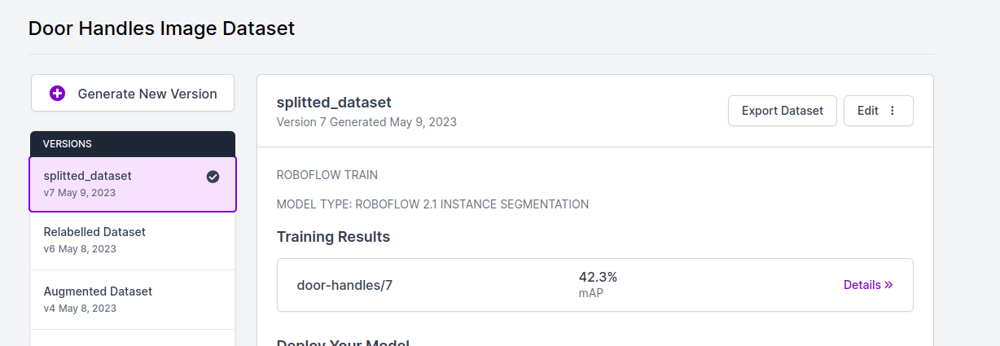
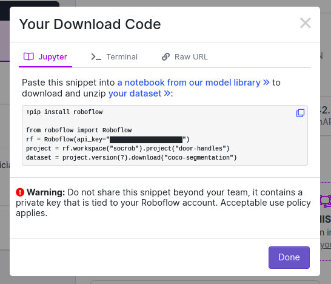

# Detectron Training
1) Label images using the Roboflow Platform (train, test, and validation images);

2) Use the Roboflow API properties to automatically download the dataset to your current directory. Press "Export Dataset" and click on "Continue" to "show download code".

<!-- <div style="display:flex;align-items:center;justify-content:center;margin-bottom:30px">
    
    
</div> -->

Export Dataset in Roboflow            |  Roboflow API
:-------------------------:|:-------------------------:
  |  

3) Copy the code from the previous step to the script train.py (DOWNLOAD DATASET FROM ROBOFLOW section in train.py).

4) Set the model configurations in train.py (HYPERPARAMETERS section in train.py).

5) Run the train.py.

6) When the training proccess is done, run the test.py script. This give you an idea of the model performance.

6) Load the model in the detectron2 node and make sure it works;


Notes:


```bash
.
├── dataset
│   ├── test
│   │   ├── img_21.json
│   │   ├── img_21.png
│   │   ├── img_22.json
│   │   ├── img_22.png
│   │   ├── img_23.json
│   │   ├── img_23.png
│   ├── test.json
│   ├── train
│   │   ├── img_0.json
│   │   ├── img_0.png
│   │   ├── img_10.json
│   │   ├── img_10.png
│   │   ├── img_11.json
│   │   ├── img_11.png
│   │   ├── img_12.json
│   │   ├── img_12.png
│   └── train.json
├── labelme2coco.py
├── model
│   ├── dataset_metadata.json
│   ├── IS_cfg.pickle
│   └── output
│       └── instance_segmentation
│           ├── events.out.tfevents.1675938979.6e88c4b466e0.217.0
│           ├── last_checkpoint
│           ├── metrics.json
│           └── model_final.pth
├── README.md
├── testDetectron.py
├── trainDetectron.py
└── utilsDetectron.py
```