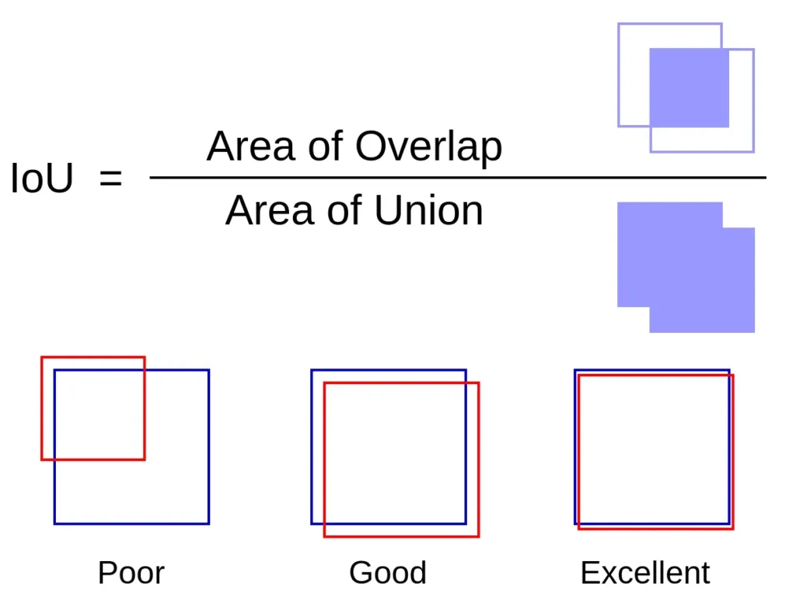

## 5. Evaluation Output Logs

Depending on the **EVAL_PERIOD** one stablishes, the training proccess will use the validation dataset to perform an evaluation test. The output is usually the one illustrated below.

### Note on the IoU

In the context of object detection and segmentation, IoU (Intersection over Union) is a metric used to evaluate the accuracy of a predicted bounding box or segmentation mask against the ground truth. Intersection over Union (IoU) is defined as the area of overlap between the predicted bounding box (or mask) and the ground truth bounding box (or mask) divided by the area of their union.

Mathematically, it can be expressed as:

<div style="display:flex; justify-content:center;">
    
</div>

where,

- **Area of Overlap** stands for the area where the predicted bounding box (or mask) overlaps with the ground truth bounding box (or mask);

- **Area of Union** represents the total area covered by both the predicted and ground truth bounding boxes (or masks);


Suppose you have a ground truth bounding box and a predicted bounding box. The intersection is the area where both boxes overlap. The union is the total area covered by both boxes together, minus the intersection area (since it is counted twice).

#### Use in Evaluation Metrics
- AP (Average Precision): The mean of precision values at different recall levels, averaged over multiple IoU thresholds (e.g., from 0.5 to 0.95 in steps of 0.05). A higher AP indicates better model performance.
- AP50: Average precision at IoU = 0.50. This means a prediction is considered correct if the IoU with the ground truth is at least 0.50.
- AP75: Average precision at IoU = 0.75. This is a stricter criterion where the prediction is correct only if the IoU is at least 0.75.


#### Importance in Object Detection and Segmentation
- IoU is a crucial metric because it quantifies the accuracy of the predicted bounding boxes and segmentation masks.
- Higher IoU values indicate better alignment between the predicted and ground truth boxes or masks.
- Models are typically evaluated at multiple IoU thresholds to ensure they perform well across different levels of strictness.

### Interpretation in Your Evaluation Output
- AP, AP50, AP75: These metrics reflect the model's precision at different IoU thresholds, showing how well the model's predictions align with the ground truth at both lenient (0.50) and strict (0.75) criteria.
- APs, APm, APl: These values indicate how well the model performs on small, medium, and large objects, considering the IoU metric to evaluate the overlap quality.


### BBox Evaluation Metrics

```
[06/11 13:51:43 d2.evaluation.testing]: copypaste: Task: bbox
[06/11 13:51:43 d2.evaluation.testing]: copypaste: AP,AP50,AP75,APs,APm,APl
[06/11 13:51:43 d2.evaluation.testing]: copypaste: 75.6260,90.9271,86.9496,60.3355,78.9204,82.8255
```

This section provides the Average Precision (AP) metrics for bounding box predictions.

- **AP**: The overall average precision across all Intersection over Union (IoU) thresholds (typically averaged over IoU thresholds from 0.5 to 0.95 in steps of 0.05).

- **AP50**: Average Precision at IoU = 0.50. This is the percentage of true positive detections when the IoU threshold is 0.50.

- **AP75**: Average Precision at IoU = 0.75. This is the percentage of true positive detections when the IoU threshold is 0.75.

- **APs**: Average Precision for small objects.

- **APm**: Average Precision for medium objects.

- **APl**: Average Precision for large objects.


### Segmentation Evaluation Metrics

```
[06/11 13:51:43 d2.evaluation.testing]: copypaste: Task: segm
[06/11 13:51:43 d2.evaluation.testing]: copypaste: AP,AP50,AP75,APs,APm,APl
[06/11 13:51:43 d2.evaluation.testing]: copypaste: 76.8922,90.6402,86.7939,60.7884,80.1442,87.2067
```

This section provides the Average Precision (AP) metrics for instance segmentation predictions.

- **AP**: The overall average precision across all IoU thresholds for segmentation masks.

- **AP50**: Average Precision at IoU = 0.50 for segmentation masks.

- **AP75**: Average Precision at IoU = 0.75 for segmentation masks.

- **APs**: Average Precision for small objects in segmentation masks.

- **APm**: Average Precision for medium objects in segmentation masks.

- **APl**: Average Precision for large objects in segmentation masks.


### Interpretation

- **AP (Overall)**: An overall measure of the model's accuracy. For bounding boxes, it's 75.6260 and for segmentation masks, it's 76.8922, in this example. These are good scores, indicating a well-performing model.

- **AP50 and AP75**: Higher values at specific IoU thresholds (90.9271 for AP50 and 86.9496 for AP75 in bbox, 90.6402 for AP50 and 86.7939 for AP75 in segm) suggest the model is very accurate at both loose and strict matching criteria.

- **AP50 and AP75**: Higher values at specific IoU thresholds (90.9271 for AP50 and 86.9496 for AP75 in bbox, 90.6402 for AP50 and 86.7939 for AP75 in segm) suggest the model is very accurate at both loose and strict matching criteria.

- **APs, APm, APl**: Performance across different object sizes. This tells you how well your model performs on small, medium, and large objects. Your model seems to perform well across all sizes but has slightly lower performance on small objects (60.3355 for bbox and 60.7884 for segm).


### Full Output Log Example

```
[06/11 13:51:26 d2.utils.events]:  eta: 1:14:41  iter: 3979  total_loss: 0.3357  loss_cls: 0.08133  loss_box_reg: 0.1264  loss_mask: 0.09609  loss_rpn_cls: 0.0004065  loss_rpn_loc: 0.02069  time: 0.7411  data_time: 0.0083  lr: 2.5e-05  max_mem: 3112M
WARNING [06/11 13:51:41 d2.data.datasets.coco]: 
Category ids in annotations are not in [1, #categories]! We'll apply a mapping for you.

[06/11 13:51:41 d2.data.datasets.coco]: Loaded 22 images in COCO format from /home/socrob/Desktop/Development/detectronTraining/FNR24-SocRob-Dataset-2/valid/_annotations.coco.json
[06/11 13:51:41 d2.data.dataset_mapper]: [DatasetMapper] Augmentations used in inference: [ResizeShortestEdge(short_edge_length=(800, 800), max_size=1333, sample_style='choice')]
[06/11 13:51:41 d2.data.common]: Serializing 22 elements to byte tensors and concatenating them all ...
[06/11 13:51:41 d2.data.common]: Serialized dataset takes 0.06 MiB
WARNING [06/11 13:51:41 d2.evaluation.coco_evaluation]: COCO Evaluator instantiated using config, this is deprecated behavior. Please pass in explicit arguments instead.
[06/11 13:51:41 d2.evaluation.evaluator]: Start inference on 22 batches
[06/11 13:51:42 d2.evaluation.evaluator]: Inference done 11/22. Dataloading: 0.0005 s/iter. Inference: 0.0651 s/iter. Eval: 0.0059 s/iter. Total: 0.0716 s/iter. ETA=0:00:00
[06/11 13:51:43 d2.evaluation.evaluator]: Total inference time: 0:00:01.353691 (0.079629 s / iter per device, on 1 devices)
[06/11 13:51:43 d2.evaluation.evaluator]: Total inference pure compute time: 0:00:01 (0.066557 s / iter per device, on 1 devices)
[06/11 13:51:43 d2.evaluation.coco_evaluation]: Preparing results for COCO format ...
[06/11 13:51:43 d2.evaluation.coco_evaluation]: Saving results to model/output/instance_segmentation/inference/coco_instances_results.json
[06/11 13:51:43 d2.evaluation.coco_evaluation]: Evaluating predictions with unofficial COCO API...
Loading and preparing results...
DONE (t=0.00s)
creating index...
index created!
[06/11 13:51:43 d2.evaluation.fast_eval_api]: Evaluate annotation type *bbox*
[06/11 13:51:43 d2.evaluation.fast_eval_api]: COCOeval_opt.evaluate() finished in 0.01 seconds.
[06/11 13:51:43 d2.evaluation.fast_eval_api]: Accumulating evaluation results...
[06/11 13:51:43 d2.evaluation.fast_eval_api]: COCOeval_opt.accumulate() finished in 0.05 seconds.
 Average Precision  (AP) @[ IoU=0.50:0.95 | area=   all | maxDets=100 ] = 0.756
 Average Precision  (AP) @[ IoU=0.50      | area=   all | maxDets=100 ] = 0.909
 Average Precision  (AP) @[ IoU=0.75      | area=   all | maxDets=100 ] = 0.869
 Average Precision  (AP) @[ IoU=0.50:0.95 | area= small | maxDets=100 ] = 0.603
 Average Precision  (AP) @[ IoU=0.50:0.95 | area=medium | maxDets=100 ] = 0.789
 Average Precision  (AP) @[ IoU=0.50:0.95 | area= large | maxDets=100 ] = 0.828
 Average Recall     (AR) @[ IoU=0.50:0.95 | area=   all | maxDets=  1 ] = 0.735
 Average Recall     (AR) @[ IoU=0.50:0.95 | area=   all | maxDets= 10 ] = 0.830
 Average Recall     (AR) @[ IoU=0.50:0.95 | area=   all | maxDets=100 ] = 0.830
 Average Recall     (AR) @[ IoU=0.50:0.95 | area= small | maxDets=100 ] = 0.642
 Average Recall     (AR) @[ IoU=0.50:0.95 | area=medium | maxDets=100 ] = 0.845
 Average Recall     (AR) @[ IoU=0.50:0.95 | area= large | maxDets=100 ] = 0.883
[06/11 13:51:43 d2.evaluation.coco_evaluation]: Evaluation results for bbox: 
|   AP   |  AP50  |  AP75  |  APs   |  APm   |  APl   |
|:------:|:------:|:------:|:------:|:------:|:------:|
| 75.626 | 90.927 | 86.950 | 60.336 | 78.920 | 82.826 |
[06/11 13:51:43 d2.evaluation.coco_evaluation]: Per-category bbox AP: 
| category         | AP     | category       | AP     | category        | AP     |
|:-----------------|:-------|:---------------|:-------|:----------------|:-------|
| socrob_fnr_24    | nan    | 7up            | 87.927 | apple           | 85.908 |
| bag              | 50.050 | banana         | 91.980 | baseball        | 80.000 |
| bowl             | 92.574 | cheezit        | 92.805 | chocolate_jello | 60.424 |
| cleanser         | 17.010 | coffee_grounds | 60.223 | cola            | 90.673 |
| cornflakes       | 76.045 | cup            | 90.858 | dice            | 52.772 |
| dishwasher_tab   | 70.000 | fork           | 66.465 | iced_tea        | 85.050 |
| juice_pack       | 86.906 | knife          | 79.983 | lemon           | 90.520 |
| milk             | 92.017 | mustard        | 84.950 | orange          | 87.789 |
| orange_juice     | 65.092 | peach          | 55.149 | pear            | 82.054 |
| plate            | 75.050 | plum           | 77.797 | pringles        | 89.317 |
| red_wine         | 63.614 | rubiks_cube    | 90.000 | shoes           | 82.912 |
| soccer_ball      | 85.545 | socks          | nan    | spam            | 80.198 |
| sponge           | 87.525 | spoon          | 61.485 | strawberry      | 22.624 |
| strawberry_jello | 63.106 | sugar          | 53.356 | tennis_ball     | 90.000 |
| tomato_soup      | 74.310 | tropical_juice | 89.624 | tuna            | 91.089 |
| water            | 74.769 |                |        |                 |        |
Loading and preparing results...
DONE (t=0.00s)
creating index...
index created!
[06/11 13:51:43 d2.evaluation.fast_eval_api]: Evaluate annotation type *segm*
[06/11 13:51:43 d2.evaluation.fast_eval_api]: COCOeval_opt.evaluate() finished in 0.01 seconds.
[06/11 13:51:43 d2.evaluation.fast_eval_api]: Accumulating evaluation results...
[06/11 13:51:43 d2.evaluation.fast_eval_api]: COCOeval_opt.accumulate() finished in 0.05 seconds.
 Average Precision  (AP) @[ IoU=0.50:0.95 | area=   all | maxDets=100 ] = 0.769
 Average Precision  (AP) @[ IoU=0.50      | area=   all | maxDets=100 ] = 0.906
 Average Precision  (AP) @[ IoU=0.75      | area=   all | maxDets=100 ] = 0.868
 Average Precision  (AP) @[ IoU=0.50:0.95 | area= small | maxDets=100 ] = 0.608
 Average Precision  (AP) @[ IoU=0.50:0.95 | area=medium | maxDets=100 ] = 0.801
 Average Precision  (AP) @[ IoU=0.50:0.95 | area= large | maxDets=100 ] = 0.872
 Average Recall     (AR) @[ IoU=0.50:0.95 | area=   all | maxDets=  1 ] = 0.743
 Average Recall     (AR) @[ IoU=0.50:0.95 | area=   all | maxDets= 10 ] = 0.836
 Average Recall     (AR) @[ IoU=0.50:0.95 | area=   all | maxDets=100 ] = 0.836
 Average Recall     (AR) @[ IoU=0.50:0.95 | area= small | maxDets=100 ] = 0.653
 Average Recall     (AR) @[ IoU=0.50:0.95 | area=medium | maxDets=100 ] = 0.854
 Average Recall     (AR) @[ IoU=0.50:0.95 | area= large | maxDets=100 ] = 0.882
[06/11 13:51:43 d2.evaluation.coco_evaluation]: Evaluation results for segm: 
|   AP   |  AP50  |  AP75  |  APs   |  APm   |  APl   |
|:------:|:------:|:------:|:------:|:------:|:------:|
| 76.892 | 90.640 | 86.794 | 60.788 | 80.144 | 87.207 |
[06/11 13:51:43 d2.evaluation.coco_evaluation]: Per-category segm AP: 
| category         | AP      | category       | AP     | category        | AP      |
|:-----------------|:--------|:---------------|:-------|:----------------|:--------|
| socrob_fnr_24    | nan     | 7up            | 88.572 | apple           | 88.383  |
| bag              | 67.525  | banana         | 85.272 | baseball        | 82.525  |
| bowl             | 100.000 | cheezit        | 89.568 | chocolate_jello | 64.286  |
| cleanser         | 19.010  | coffee_grounds | 59.802 | cola            | 89.943  |
| cornflakes       | 78.534  | cup            | 95.050 | dice            | 51.947  |
| dishwasher_tab   | 70.000  | fork           | 59.208 | iced_tea        | 80.099  |
| juice_pack       | 87.525  | knife          | 64.530 | lemon           | 88.040  |
| milk             | 90.858  | mustard        | 89.760 | orange          | 81.584  |
| orange_juice     | 72.687  | peach          | 68.482 | pear            | 87.211  |
| plate            | 79.109  | plum           | 73.168 | pringles        | 92.801  |
| red_wine         | 64.917  | rubiks_cube    | 90.000 | shoes           | 80.348  |
| soccer_ball      | 90.000  | socks          | nan    | spam            | 83.498  |
| sponge           | 91.749  | spoon          | 52.673 | strawberry      | 22.624  |
| strawberry_jello | 69.257  | sugar          | 55.366 | tennis_ball     | 100.000 |
| tomato_soup      | 71.860  | tropical_juice | 88.819 | tuna            | 95.545  |
| water            | 81.122  |                |        |                 |         |
[06/11 13:51:43 d2.engine.defaults]: Evaluation results for FNR24-SocRob-Dataset-valid in csv format:
[06/11 13:51:43 d2.evaluation.testing]: copypaste: Task: bbox
[06/11 13:51:43 d2.evaluation.testing]: copypaste: AP,AP50,AP75,APs,APm,APl
[06/11 13:51:43 d2.evaluation.testing]: copypaste: 75.6260,90.9271,86.9496,60.3355,78.9204,82.8255
[06/11 13:51:43 d2.evaluation.testing]: copypaste: Task: segm
[06/11 13:51:43 d2.evaluation.testing]: copypaste: AP,AP50,AP75,APs,APm,APl
[06/11 13:51:43 d2.evaluation.testing]: copypaste: 76.8922,90.6402,86.7939,60.7884,80.1442,87.2067
[06/11 13:51:43 d2.utils.events]:  eta: 1:14:25  iter: 3999  total_loss: 0.2861  loss_cls: 0.07012  loss_box_reg: 0.114  loss_mask: 0.08779  loss_rpn_cls: 0.0003539  loss_rpn_loc: 0.01417  time: 0.7411  data_time: 0.0078  lr: 2.5e-05  max_mem: 3112M
```

